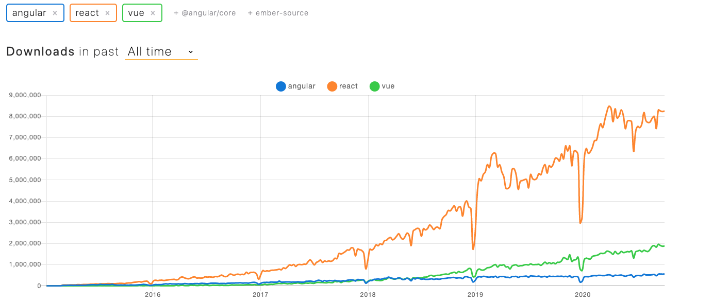

*Note*: React is technically a library, but for argument and continuities sake, you're going to have to deal with the label here.

We're going to specifically be talking about Angular, React, and Vue. More specifically, this is meant as a high level overview of their uses-cases and what you get or don't get out of the box. Ultimately, we'll be visiting these more in depth in coming blogs as part of a series of write ups I'm doing on front end development, with a goal of going into more detail over time.

Let's start with the basics: what are each of these and how did they get here? 

# React

React was created by a software engineer at Facebook by the name of Jordan Walke with an initial release of 2013. React is, by definition, an open source, front end, JavaScript library for building user interfaces or UI compontents. It's also maintained by Facebook as well as a commmunity of individual developers/companies. 

# Angular

Angular is a JS-based open-source front end framework that was created to address many of the issues one might face while developing single page applications (SPAs). It was developed, and primarily maintained, by Google with an initial release of 2010. 

# Vue

Vue was created by Evan You in early 2014 and it is an open-source Model-View-Viewmodel (MVVM) front end JavaScript framework. Keeping with the theme here, it looks to solve some of the challenges of building UI's and SPA's. 

Now that there's a little background, let's get into the meat of why you might want to use one over the other, as they each have their own trade-offs. For our purposes, we're going to be concerned with UI/DOM Manipulation, State Management, Routing, and Form Validation, and http client functions.

React effectively does one thing*, but it does it quite well. React is a tool to render content to and control content on the DOM. I wrote a blog a few months back about the similarities between React and Legos and I still find that to hold true, especially given the componentized structure of React, it's meant to be a plug and play UI. React will cover your back on DOM Manipulation and sorta with State Management via the advent of Hooks/Redux/Lifecycle Methods. That's about it, though that is quite the over simplification.

Vue on the other hand, is sort of the middle sibling, in that it does a few things quite well, but not all of the things we might need. With Vue you will have access to built-in state mangement as well as a built in router. That said, you're effectively on your own for form validation http client functionality.

Lastly, with Angular, you get the kitchen sink. You'll be on the receiving end of functionality to control the DOM/UI, manage state, routing, form validation, and http client functionality. That's great! Angular gives you the tools you need to accomplish quite literally anything you need to handle front end development. As we've come to expect from a Google tool, Angular attempts to solve all of your problems. However, Angular is written in Typescript, and you'll need that knowledge base as a result. 

# Summary

So, you'll probably walk away from this thinking that because Angular does it all, it's clearly the right tool to use, which is incorrect. Each of these frameworks serves unique purposes that you'll adapt to your own needs. 

It's worth noting that you can take a look at the all-time npm downloads to gauge just how popular React is as opposed to Angular or Vue, but that falls under the argument that correlation !== causation.

See NPM download graph below:

<!-- <image src='../images/npmDownload.png'> -->

If you take anything away from this, it is that you should look into each of these for use cases related to whatever project you're doing. I know I'll be spending some time with Angular and Vue in the near future to get more familiar; I hope you'll do the same. 

