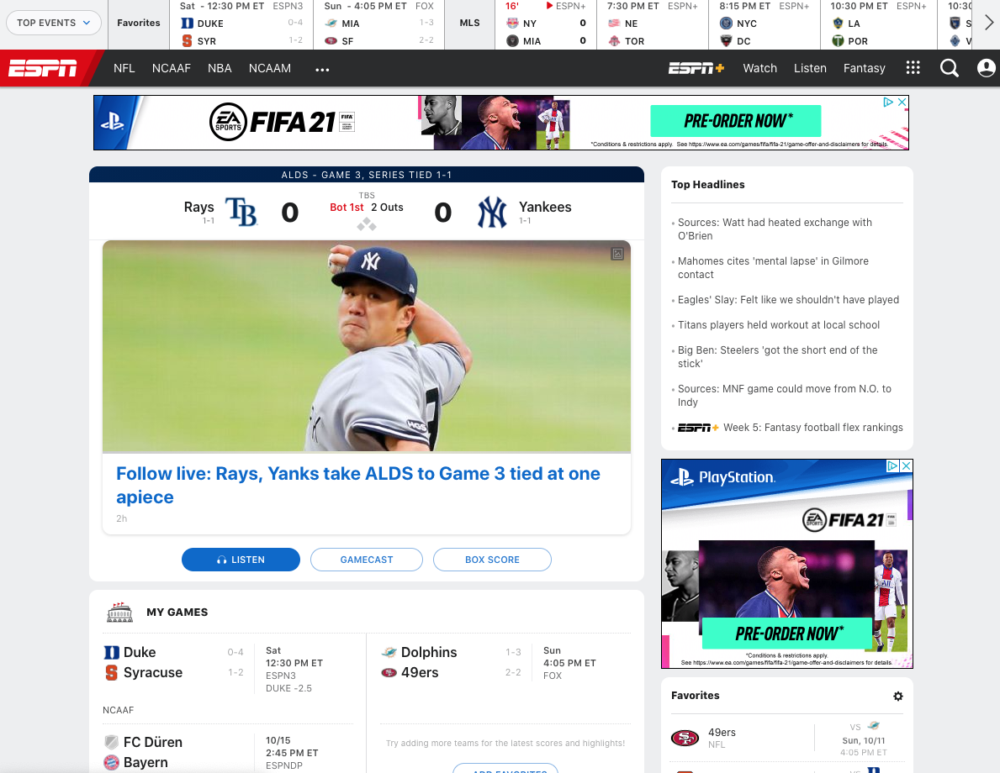
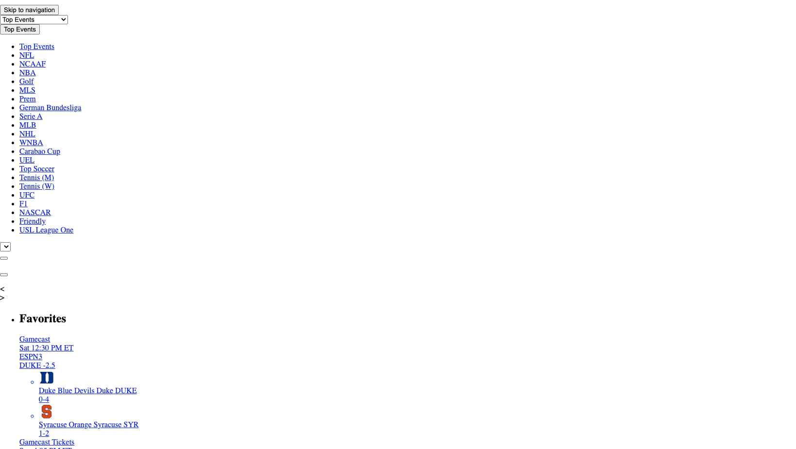
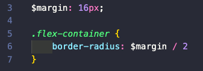

So, to date, I've put together a few applications and as a result I've had to take on the responsibility of styling them. I've actually found the frontend of development to be something I really enjoy, and frankly,
as someone who got absolutely none of the creative genes in the family, this was a nice surprise. Frontend development has provided me a way to express whatever semblance of a a creative side I might have, but like most new developers, my styling started as more of a hot mess rather than a neatly organized style sheet. Not to mention once you (sorta) get CSS down, you come across things like SCSS and Sass. 

This blog is my attempt to hopefully educate you, and perhaps even more so myself, on styling and convention. Let's break it all down, shall we? 

# What is CSS?
CSS stands for Cascading Style Sheets and by definition it is a "declrative language that controls how webpages look in the browser". For the uninitiated, that basically boils down to the difference between your website looking like this: 

or like this: 

In a short but sweet walkthrough of how this is done, we can break each part of a website down to its respective HTML elements. You take a selector, like a < p > tag, and apply a set of rules to it, such as { background-color: black }, and in this case all of the paragraph elements will have a black background color. There's really a limitless amount of changes you can make, as well as an entire subreddit devoted to CSS art (link). Why cascading? Well, per the documentation, "cascading" refers to the rules that govern how selectors are prioritized to change the appearance of the webpage. All this means is that if I change the background color of the paragraph elements to black on line 3, and then change it to pink on line 4, the elements will have a pink background color as the code on line 3 is overwritten on the following line. That's CSS! Sorta. There's obviously infinitely more that you can do with it, but in a nutshell that is how we style webpages. 

All of that said, if you're anything like me in the beginning, you're just going to word-vomit CSS until the application starts to look like what it did in your brain. This is a terrible idea and if you can avoid it and learn naming convention before you start, please do. (Shout out to a new friend who passed on this gem of a resource http://getbem.com/naming/)

# Sass and SCSS - What's the deal? 

Enter Sass! From their website, we can clear up the initial confusion of the difference between the two:

"Sass supports two different syntaxes. Each one can load the other, so it's up to you and your team which one to choose". 

What this basically boils down to is the way in which you format and name things in your files, with some nuance here and there. 

You'll find SCSS behind any file with a .scss extension and it will look eerily similar to CSS in that it will still hold bracket notation. 

Similarly, you'll find Sass behind the .sass extension. The main difference being that it is structured with indented syntax.

Now, it's not all that simple, and syntax isn't the reason you choose to use plain CSS over a preprocessor. As programmers, we are lazy, or so I am told, and we prefer to write less if we can. In the simple examples above, you'll notice I'm using variables to denote the margin which is one of the features of a preprocessor. You can also nest CSS selectors in a way that is more legible (in my opinion); you can modularize your files with the @use rule; you can create @mixin's that allow you to reuse CSS declaration; you can extend or inherit CSS properties from another selector; and you can also use math operators to calculate values for things like margin, width, height, etc. 

There is quite honestly an entire world of CSS out there, and in doing the research for this blog I have found myself very excited to try styling with some of these tricks that I haven't yet messed with. Hopefully, this clears up a small piece of confusion around CSS and Sass/SCSS. 

Happy styling! 

Some Resources
---

CSS, but fun!
Flexbox Froggy (https://flexboxfroggy.com/)

CSS Grid Garden (https://cssgridgarden.com/)

Flexbox Zombies (https://geddski.teachable.com/p/flexbox-zombies)

CSS Cheatsheet:
    <image src='https://www.10bestdesign.com/blog/content/images/2018/10/31.png' alt='no image shown'>

Layout Generator (https://csslayout.io/patterns/)

CSS Grid Generator (https://cssgrid-generator.netlify.app/)